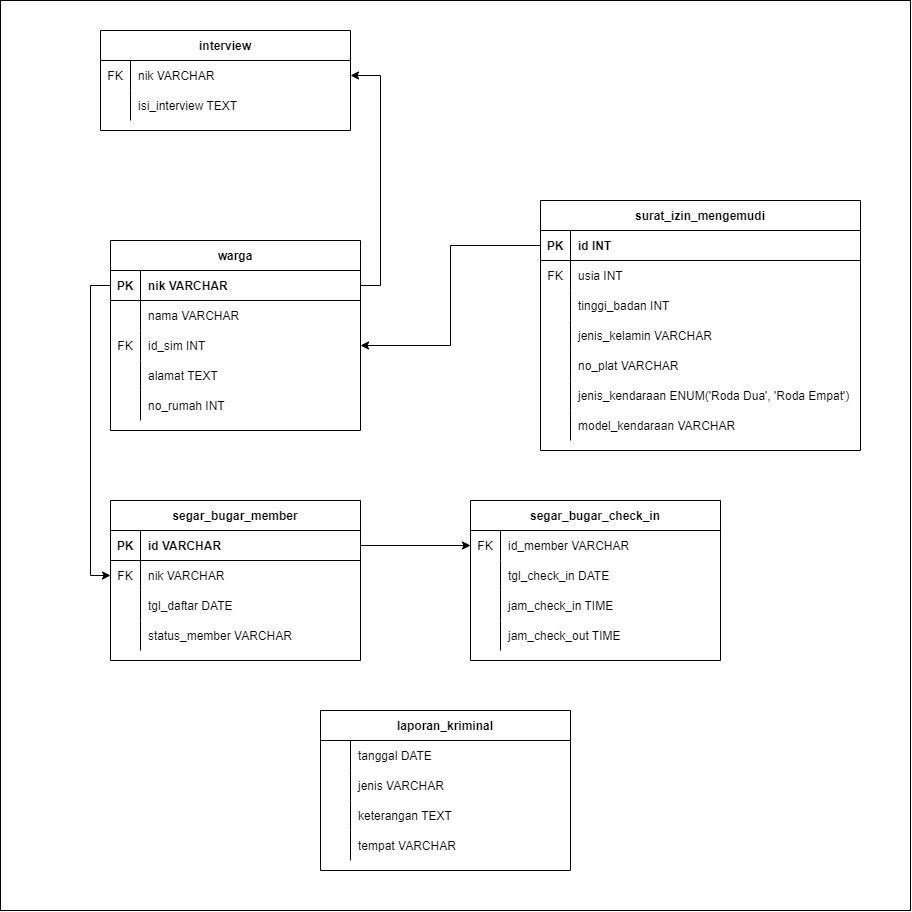

<h1>Quiz Detektif SQL 🔍</h1>

Kamu lagi magang di kantor polisi dan dikasih tugas buat bantuin detektif nyelesain kasus penting 🕵️‍♀️

Tapi sialnya... berkas kasusnya malah hilang dari mejamu! 😱

Sekarang si detektif nanya: siapa pelaku pembunuhan yang terjadi di <b>Kompleks Anggrek</b> tanggal <b>17 Juli 2020</b>? 🤔

Untungnya kamu masih punya akses ke database rahasia yang isinya catatan-catatan kriminal 🔐

 

Kurang lebih skema datanya kayak gini nih:

<h2>🕵️‍♂️ Gimana Cara Mainnya?</h2>

<ol>
<li>Akses link berikut: <b>https://ram2thedani.github.io/quiz_detektif/</b></li>
<li>Pakai SQL buat nyusurin database dan cari siapa pelakunya.</li>
<li>Masukin jawaban kamu di link ini: <b>https://thel1012.github.io/q1a/</b></li>
<li>Pastikan jawabanmu kuat — dunia detektif gak bisa ngandelin tebak-tebakan 😎</li>
</ol>

🔎 <b>Siap jadi detektif beneran?</b> Yuk buktikan kemampuan investigasimu sekarang!

<h4>📌 Catatan:</h4>
<ul>
  <li>Quiz ini adalah versi alih bahasa dari game "SQL Murder Mystery" dari https://mystery.knightlab.com/</li>
  <li>Semua nama dan kejadian di database ini fiksi dan cuma buat latihan aja.</li>
  <li>Data dummy dibuat secara acak dan gak ada hubungannya dengan dunia nyata.</li>
  <li>Kalau ada yang mirip sama orang atau tempat beneran, itu kebetulan doang 😅</li>
</ul>
